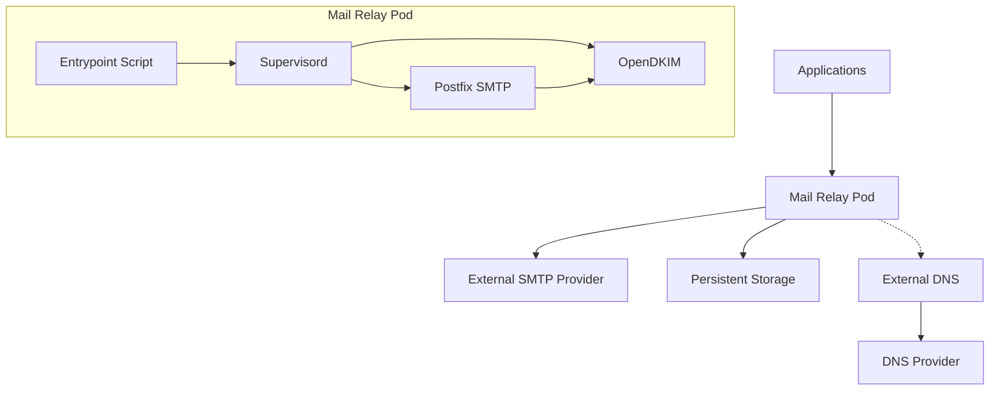

# Mail Relay Helm Chart

A production-ready Helm chart for deploying a secure SMTP mail relay server on Kubernetes with Postfix, OpenDKIM support, and containerized architecture.

## 🚀 Features

- **🔐 Secure Mail Relay**: Postfix-based SMTP relay with IPv4-only configuration
- **✍️ DKIM Signing**: Automatic DKIM key generation and email signing with OpenDKIM
- **🌐 DNS Management**: Automated DNS record management with external-dns integration
- **💾 Persistent Storage**: Optional persistent storage for mail queue and DKIM keys
- **❤️ Health Monitoring**: Built-in health checks and TCP probes
- **🔒 Security**: Network policies, RBAC, and security contexts
- **📊 Logging**: Direct stdout logging with supervisord process management
- **🐳 Containerized**: Supervisord-managed services with environment variable configuration

## 🚨 SECURITY WARNING: Open Relay Prevention

> **⚠️ CRITICAL: Improper configuration when exposing the mail relay externally can make it an OPEN RELAY, allowing spammers to abuse your server!**

### Understanding the Risk

When you expose the mail relay via `LoadBalancer` or `NodePort`:

1. External traffic may be SNAT'd by Kubernetes to internal IPs (e.g., `10.x.x.x`)
2. If `trustedNetworks` includes broad ranges like `10.0.0.0/8`, external attackers appear as "trusted"
3. Postfix will relay mail for anyone appearing to be from a trusted network

### Required Security Configuration

**1. Use restrictive `trustedNetworks`** (MANDATORY):

```yaml
mail:
  trustedNetworks:
    - "127.0.0.0/8" # Localhost only
    - "10.42.0.0/16" # Your SPECIFIC pod CIDR (example)
    # DO NOT use 10.0.0.0/8 or other wide ranges!
```

**2. Enable `externalTrafficPolicy: Local`** (CRITICAL for external exposure):

```yaml
service:
  type: LoadBalancer
  externalTrafficPolicy: "Local" # Preserves real client IPs!
```

**3. Enable Network Policies** (Defense in depth):

```yaml
networkPolicy:
  enabled: true
  ingress:
    allowedCIDRs:
      - "10.42.0.0/16" # Your pod network only
```

### Testing for Open Relay

After deployment, test from an EXTERNAL network:

```bash
# From outside your cluster
telnet <loadbalancer-ip> 25
EHLO test.com
MAIL FROM: <attacker@evil.com>
RCPT TO: <victim@gmail.com>

# If you see "250 Ok" for RCPT TO, you have an OPEN RELAY!
# Expected response: "554 Relay access denied"
```

### Quick Security Checklist

- [ ] `trustedNetworks` contains ONLY specific, narrow CIDRs
- [ ] `externalTrafficPolicy: "Local"` is set (for LoadBalancer/NodePort)
- [ ] Network policies are enabled
- [ ] Tested relay restrictions from external network

## 🔄 PROXY Protocol Support

Haraka supports HAProxy PROXY Protocol (v1 and v2), enabling real client IP preservation when using LoadBalancers that support it (AWS NLB, HAProxy, Nginx, MetalLB, etc.).

### Benefits

- **Real Client IP Logging**: Logs show actual sender IPs, not load balancer IPs
- **SPF Validation**: SPF checks work correctly with the original client IP
- **Network Policies**: Filter by real client IPs instead of proxy IPs
- **Allows `externalTrafficPolicy: Cluster`**: Get load balancing benefits while preserving client IPs

### Configuration

```yaml
haraka:
  proxyProtocol:
    # Enable PROXY protocol parsing
    enabled: true

    # Trust only your load balancer network
    trustedProxies:
      - "10.0.0.0/8" # LoadBalancer internal network
      # - "172.16.0.0/12"   # Additional trusted networks
```

### LoadBalancer Configuration Examples

**AWS Network Load Balancer (NLB):**

```yaml
service:
  type: LoadBalancer
  annotations:
    service.beta.kubernetes.io/aws-load-balancer-type: "nlb"
    service.beta.kubernetes.io/aws-load-balancer-proxy-protocol: "*"

haraka:
  proxyProtocol:
    enabled: true
    trustedProxies:
      - "10.0.0.0/8" # VPC CIDR
```

**MetalLB with PROXY Protocol:**

```yaml
service:
  type: LoadBalancer
  annotations:
    metallb.universe.tf/loadBalancerIPs: "192.168.1.100"

# Requires external proxy (HAProxy/Nginx) with PROXY protocol enabled
haraka:
  proxyProtocol:
    enabled: true
    trustedProxies:
      - "192.168.1.0/24" # Proxy server network
```

### ⚠️ Important Notes

1. **Both sides must agree**: LoadBalancer MUST send PROXY headers when Haraka expects them
2. **Trust only your proxies**: Never trust `0.0.0.0/0` in production - attackers could spoof client IPs
3. **Test thoroughly**: Misconfiguration breaks SMTP connections entirely

## � Delivery Rate Limiting (Gmail/Yahoo Warmup)

Major email providers (Gmail, Yahoo, Microsoft) throttle or block new senders who deliver too fast. This feature lets you slow down outbound delivery to build reputation gradually.

### Why Rate Limiting Matters

Gmail doesn't block Haraka — **Gmail blocks behavior typical of spammers**:

- Instant bursts of many messages
- Multiple concurrent connections
- No natural pauses between deliveries

A "trusted" mail server looks like a slow, old Postfix from 2008.

### Configuration

```yaml
rateLimit:
  enabled: true

  # Per-domain limits for major providers
  domains:
    gmail.com:
      enabled: true
      maxConnections: 1 # Only 1 connection at a time
      maxPerConnection: 3 # Max 3 messages per connection
      rate: "1/20s" # 1 message every 20 seconds
      delayMs: 15000 # 15 second delay between messages

    outlook.com:
      enabled: true
      maxConnections: 2
      rate: "1/10s"

  # Custom domain limits
  customDomains:
    corporate-client.com:
      maxConnections: 5
      rate: "10/1m" # 10 messages per minute
```

### IP Warmup Schedule

For new IPs, gradually increase volume over 1-2 weeks:

| Day | Gmail messages/day |
| --- | ------------------ |
| 1   | 20                 |
| 2   | 40                 |
| 3   | 80                 |
| 4   | 150                |
| 5   | 300                |
| 6   | 600                |
| 7   | 1000               |

After 7+ days with good delivery, Gmail will automatically increase your limits.

### Success Indicators

In Haraka logs:

```
# ❌ Bad - Gmail doesn't trust you
421 4.7.0 Try again later

# ✅ Good - Delivered successfully
250 2.0.0 OK

# ✅ Great - Gmail trusts you but regulates pace
421 4.7.28 Rate limited, try again later
```

The `4.7.28` response means Gmail trusts your server but wants you to slow down temporarily.

## 🔄 Adaptive Rate Limiting (Dynamic)

Static rate limits work but require manual tuning. **Adaptive rate limiting** automatically adjusts delivery speed based on server responses:

- **On 421/rate limit errors**: Slows down (exponential backoff)
- **On successful deliveries**: Speeds up (gradual recovery)
- **Per-domain tracking**: Each domain has independent rate state

### How It Works

```
Start: delay=20s for gmail.com

Deliver → Success → Success → Success → Success → Success (5 in a row)
→ delay reduced to 18s (recovery)

Deliver → 421 4.7.28 Rate limited
→ delay increased to 36s (backoff ×2)
→ Extra penalty: delay increased to 54s (rate limit detected)

Continue delivering...
→ After many successes: delay returns to minimum (15s)
```

### Configuration

```yaml
adaptiveRate:
  enabled: true

  # Default settings
  defaults:
    minDelay: 1000 # Won't go faster than 1 second
    maxDelay: 60000 # Won't go slower than 60 seconds
    initialDelay: 5000 # Start at 5 seconds
    backoffMultiplier: 1.5 # +50% delay on failure
    recoveryRate: 0.9 # -10% delay on success
    successThreshold: 5 # Need 5 successes to speed up

  # Per-domain settings (Gmail needs extra care)
  domains:
    gmail.com:
      enabled: true
      minDelay: 15000 # 15 second minimum
      maxDelay: 120000 # 2 minute maximum
      initialDelay: 20000 # Start at 20 seconds
      backoffMultiplier: 2.0 # Double on failure
      successThreshold: 10 # Need 10 successes
```

### Static vs Adaptive Rate Limiting

| Aspect                   | Static (`rateLimit`)  | Adaptive (`adaptiveRate`) |
| ------------------------ | --------------------- | ------------------------- |
| Configuration            | Fixed rate per domain | Auto-adjusts              |
| New IP warmup            | Manual schedule       | Automatic                 |
| Responds to 421 errors   | No                    | Yes (slows down)          |
| Recovery after good runs | No                    | Yes (speeds up)           |
| Use case                 | Hard safety caps      | Dynamic optimization      |

**Recommendation**: Use both together:

```yaml
# Hard cap - never exceed these limits
rateLimit:
  enabled: true
  domains:
    gmail.com:
      enabled: true
      rate: "1/10s" # Absolute maximum: 6/minute

# Dynamic within cap - auto-tune actual rate
adaptiveRate:
  enabled: true
  domains:
    gmail.com:
      enabled: true
      minDelay: 15000 # Will be slower than cap when needed
```

## �📋 Architecture



## ⚡ Quick Start

### Prerequisites

- Kubernetes 1.20+
- Helm 3.2+
- LoadBalancer service support
- Container registry access (for custom builds)

### Installation

1. **Clone the repository**:

```bash
git clone https://github.com/lnking81/mail-relay-chart.git
cd mail-relay-chart
```

2. **Configure your values**:

```bash
cp values.byc.yaml my-values.yaml
# Edit my-values.yaml with your configuration
```

3. **Install the chart**:

```bash
# Install from local chart
helm install my-mail-relay ./chart -f my-values.yaml

# Or with namespace
helm install my-mail-relay ./chart -f my-values.yaml -n mail --create-namespace
```

## ⚙️ Configuration

### Core Parameters

| Parameter             | Description          | Default                             | Required |
| --------------------- | -------------------- | ----------------------------------- | -------- |
| `mail.hostname`       | SMTP server hostname | `mail.example.com`                  | ✅       |
| `mail.domains[].name` | Domains to handle    | `[]`                                | ✅       |
| `mail.relayHost`      | External SMTP relay  | `smtp.gmail.com`                    | ✅       |
| `mail.relayPort`      | External SMTP port   | `587`                               | ✅       |
| `image.repository`    | Container image      | `ghcr.io/lnking81/mail-relay-chart` | ✅       |
| `image.tag`           | Container tag        | `latest`                            | ✅       |

### DKIM Configuration

| Parameter           | Description         | Default |
| ------------------- | ------------------- | ------- |
| `dkim.enabled`      | Enable DKIM signing | `true`  |
| `dkim.autoGenerate` | Auto-generate keys  | `true`  |
| `dkim.keySize`      | RSA key size        | `2048`  |

### Storage Configuration

| Parameter                  | Description               | Default |
| -------------------------- | ------------------------- | ------- |
| `persistence.enabled`      | Enable persistent storage | `true`  |
| `persistence.size`         | Storage size              | `1Gi`   |
| `persistence.storageClass` | Storage class             | `""`    |

### Example Configuration

```yaml
# my-values.yaml
mail:
  hostname: mail.mycompany.com
  domains:
    - name: mycompany.com
      dkimSelector: mail
  relayHost: smtp.gmail.com
  relayPort: 587
  relayCredentials:
    enabled: true
    username: "your-username"
    password: "your-app-password"

dkim:
  enabled: true
  autoGenerate: true
  keySize: 2048

service:
  type: LoadBalancer
  loadBalancerIP: "192.168.1.100"

persistence:
  enabled: true
  size: 2Gi

externalDns:
  enabled: true
  provider: cloudflare
  autoManageDnsRecords: true
```

## 🐳 Container Architecture

### Environment Variables

The container uses environment variables for configuration:

| Variable                    | Description             | Source                          |
| --------------------------- | ----------------------- | ------------------------------- |
| `DKIM_ENABLED`              | Enable DKIM             | `dkim.enabled`                  |
| `DKIM_AUTO_GENERATE`        | Auto-generate keys      | `dkim.autoGenerate`             |
| `DKIM_KEY_SIZE`             | RSA key size            | `dkim.keySize`                  |
| `DKIM_DOMAINS`              | Comma-separated domains | `mail.domains`                  |
| `RELAY_CREDENTIALS_ENABLED` | Enable SMTP auth        | `mail.relayCredentials.enabled` |
| `SENDER_ACCESS_ENABLED`     | Enable sender access    | `mail.senderAccess.enabled`     |
| `PERSISTENCE_ENABLED`       | Enable persistence      | `persistence.enabled`           |

### Process Management

The container uses **supervisord** for robust process management:

| Service    | Purpose                 | Startup Priority | Auto-restart |
| ---------- | ----------------------- | ---------------- | ------------ |
| `opendkim` | DKIM email signing      | 100              | ✅           |
| `postfix`  | SMTP mail relay service | 200              | ✅           |

### Logging Architecture

**Direct stdout logging** without intermediate services:

```
Postfix   → stdout (via maillog_file = /dev/stdout)
OpenDKIM  → stdout (via -f -v flags, Syslog = no)
Supervisord → Container stdout/stderr
```

### Building Custom Image

```bash
# Build the container
cd mail-relay-chart
docker build -t ghcr.io/your-username/mail-relay-chart:latest ./docker/

# Push to registry
docker push ghcr.io/your-username/mail-relay-chart:latest

# Update values.yaml
image:
  repository: ghcr.io/your-username/mail-relay-chart
  tag: latest
```

## 🌐 DNS Configuration

### DNS Provider Options

The chart supports two DNS management modes:

| Provider       | Description                                          | Best For                       |
| -------------- | ---------------------------------------------------- | ------------------------------ |
| `external-dns` | Creates DNSEndpoint CRDs for external-dns controller | Existing external-dns setup    |
| `cloudflare`   | Direct Cloudflare API integration                    | Reliable TXT record management |

> **Why Cloudflare native?** external-dns has known issues with updating TXT records (DKIM, SPF, DMARC). The native Cloudflare provider ensures reliable record creation and updates.

### Cloudflare DNS (Recommended for Cloudflare Users)

#### 1. Create Cloudflare API Token

1. Go to [Cloudflare API Tokens](https://dash.cloudflare.com/profile/api-tokens)
2. Create a token with these permissions:
   - **Zone:DNS:Edit** - for all zones you want to manage
   - **Zone:Zone:Read** - to list zones

#### 2. Configure the Chart

```yaml
dns:
  enabled: true
  provider: cloudflare

  cloudflare:
    # Option A: Inline token (not recommended for production)
    apiToken: "your-cloudflare-api-token"

    # Option B: Use existing Kubernetes secret (recommended)
    existingSecret: "my-cloudflare-secret"
    # Secret must have key: api-token

    # Optional: Explicit zone IDs (auto-detected if not set)
    zoneIds:
      example.com: "abc123zoneid..."

    # Enable Cloudflare proxy for A records (orange cloud)
    proxied: false

  # Records to create
  records:
    a: true # A record for mail hostname
    mx: true # MX record pointing to mail hostname
    spf: true # SPF TXT record with server IPs
    dkim: true # DKIM TXT record from generated keys
    dmarc: true # DMARC TXT record

  # SPF/DMARC policies
  spfPolicy: "~all"
  dmarcPolicy: none
```

#### 3. Create Secret for API Token

```bash
kubectl create secret generic my-cloudflare-secret \
  --namespace mail \
  --from-literal=api-token="your-cloudflare-api-token"
```

#### DNS Records Created

With `mail.hostname: mail.example.com` and domain `example.com`:

| Record Type | Name                         | Value                                    |
| ----------- | ---------------------------- | ---------------------------------------- |
| A           | mail.example.com             | <detected-ip>                            |
| MX          | example.com                  | 10 mail.example.com                      |
| TXT         | example.com                  | v=spf1 ip4:<ip> ~all                     |
| TXT         | mail.\_domainkey.example.com | v=DKIM1; k=rsa; p=<public-key>           |
| TXT         | \_dmarc.example.com          | v=DMARC1; p=none; rua=mailto:postmaster@ |

### external-dns Integration

If you have external-dns already deployed:

```yaml
dns:
  enabled: true
  provider: external-dns

  externalDns:
    enabled: true
```

This creates `DNSEndpoint` CRDs that external-dns will process.

> **Note**: external-dns may have issues updating existing TXT records. Consider the native Cloudflare provider if you experience DNS update problems.

### Automatic DNS Management

With external-dns enabled, the following records are created automatically:

```yaml
externalDns:
  enabled: true
  provider: cloudflare # or route53, google, etc.
  autoManageDnsRecords: true

  # Owner ID must match your external-dns installation
  # Check your external-dns deployment for the --txt-owner-id parameter
  ownerId: "k8s-cluster-external-dns" # Default value
  # For multiple clusters, use unique IDs like:
  # ownerId: "prod-cluster-external-dns"
  # ownerId: "staging-cluster-external-dns"
```

> **Important**: The `ownerId` must match the `--txt-owner-id` parameter in your external-dns deployment.
> Check with: `kubectl describe deployment external-dns -n kube-system | grep txt-owner-id`

### IP Detection Configuration

When using automatic DNS management, you can control how external IPs are determined:

#### Option 1: Automatic IP Detection (Default)

```yaml
externalDns:
  enabled: true
  autoManageDnsRecords: true

dnsHelper:
  enabled: true
  ipDetection: true # Default - auto-detect external IP
  # No externalIps specified - will detect automatically
```

#### Option 2: Manual IP Configuration

```yaml
externalDns:
  enabled: true
  autoManageDnsRecords: true

dnsHelper:
  enabled: true
  ipDetection: false # Disable auto-detection
  externalIps: # Use these IPs instead
    - "203.0.113.1"
    - "203.0.113.2"
```

#### Option 3: Hybrid (Manual IPs take precedence)

```yaml
externalDns:
  enabled: true
  autoManageDnsRecords: true

dnsHelper:
  enabled: true
  ipDetection: true # Enabled but will be ignored
  externalIps: # These take precedence
    - "203.0.113.1"
```

#### Behavior Summary:

| ipDetection | externalIps | Behavior                                            |
| ----------- | ----------- | --------------------------------------------------- |
| true        | []          | Auto-detect IP from external services (every 5 min) |
| false       | [ips...]    | Use specified IPs (check every 6 hours)             |
| true        | [ips...]    | Use specified IPs (check every 6 hours)             |
| false       | []          | ❌ Error - must provide IPs when detection disabled |

#### DNS Record Results:

**Auto-detection mode:**

- A: mail.example.com → <detected-ip>
- SPF: "v=spf1 ip4:<detected-ip> a:mail.example.com ~all"

**Manual IP mode:**

- A: mail.example.com → 203.0.113.1, 203.0.113.2
- SPF: "v=spf1 ip4:203.0.113.1 ip4:203.0.113.2 a:mail.example.com ~all"

### Manual DNS Configuration

If not using external-dns, create these DNS records:

```
# A record pointing to your LoadBalancer IP
mail.mycompany.com.  300  IN  A     192.168.1.100

# MX record for your domain
mycompany.com.       300  IN  MX    10 mail.mycompany.com.

# DKIM TXT record (get from pod logs)
mail._domainkey.mycompany.com.  300  IN  TXT  "v=DKIM1; k=rsa; p=MIGfMA0GCS..."
```

## 🔧 Operations

### Viewing DKIM Public Keys

```bash
# Get DKIM public keys for DNS
kubectl exec -n mail deployment/my-mail-relay -- find /data/dkim-keys -name "*.txt" -exec cat {} \;
```

### Testing Mail Relay

```bash
# Port forward for testing
kubectl port-forward -n mail service/my-mail-relay 2525:25

# Test SMTP connection
telnet localhost 2525
# > EHLO test.com
# > MAIL FROM: test@mycompany.com
# > RCPT TO: recipient@example.com
# > DATA
# > Subject: Test Email
# >
# > This is a test email.
# > .
# > QUIT
```

### Monitoring and Logs

```bash
# View container logs
kubectl logs -n mail deployment/my-mail-relay -f

# Check service status
kubectl get svc,pods -n mail

# View events
kubectl get events -n mail --sort-by='.firstTimestamp'
```

### Health Checks

The deployment includes TCP health checks:

```yaml
livenessProbe:
  tcpSocket:
    port: smtp
  initialDelaySeconds: 30
  periodSeconds: 10

readinessProbe:
  tcpSocket:
    port: smtp
  initialDelaySeconds: 15
  periodSeconds: 5
```

## 🚨 Troubleshooting

### Common Issues

#### 1. Container Startup Issues

```bash
# Check pod status
kubectl describe pod -n mail -l app.kubernetes.io/name=mail-relay

# Check container logs
kubectl logs -n mail deployment/my-mail-relay --previous

# Check individual service status via supervisord
kubectl exec -n mail deployment/my-mail-relay -- supervisorctl status
```

#### 2. Postfix Permission Errors

```bash
# If permissions are wrong, restart the pod to trigger permission rebuild
kubectl rollout restart -n mail deployment/my-mail-relay
```

#### 3. Service Management

```bash
# Restart individual services without restarting container
kubectl exec -n mail deployment/my-mail-relay -- supervisorctl restart postfix
kubectl exec -n mail deployment/my-mail-relay -- supervisorctl restart opendkim

# Check service logs
kubectl exec -n mail deployment/my-mail-relay -- supervisorctl tail postfix
kubectl exec -n mail deployment/my-mail-relay -- supervisorctl tail opendkim
```

#### 4. SMTP Connection Problems

```bash
# Test from within cluster
kubectl run test-pod --rm -it --image=busybox -- sh
# > telnet my-mail-relay.mail.svc.cluster.local 25
```

#### 5. DKIM Key Issues

```bash
# Check DKIM directory
kubectl exec -n mail deployment/my-mail-relay -- ls -la /data/dkim-keys/

# Regenerate DKIM keys
kubectl exec -n mail deployment/my-mail-relay -- rm -rf /data/dkim-keys/*
kubectl rollout restart -n mail deployment/my-mail-relay
```

#### 4. DNS Resolution Issues

```bash
# Check external-dns logs
kubectl logs -n kube-system deployment/external-dns

# Test DNS resolution
kubectl exec -n mail deployment/my-mail-relay -- nslookup gmail.com
```

### IPv6 Disabled Architecture

This chart uses IPv4-only configuration to avoid container DNS resolution issues:

```bash
# Verify IPv4-only mode
kubectl exec -n mail deployment/my-mail-relay -- postconf inet_protocols
# Should output: inet_protocols = ipv4
```

## 🔄 Backup and Recovery

### Backup Persistent Data

```bash
# Create backup
kubectl exec -n mail deployment/my-mail-relay -- tar -czf /tmp/mail-backup.tar.gz /data

# Copy backup locally
POD_NAME=$(kubectl get pods -n mail -l app.kubernetes.io/name=mail-relay -o jsonpath='{.items[0].metadata.name}')
kubectl cp mail/$POD_NAME:/tmp/mail-backup.tar.gz ./mail-backup-$(date +%Y%m%d).tar.gz
```

### Restore from Backup

```bash
# Copy backup to pod
kubectl cp ./mail-backup.tar.gz mail/$POD_NAME:/tmp/mail-backup.tar.gz

# Restore data
kubectl exec -n mail deployment/my-mail-relay -- tar -xzf /tmp/mail-backup.tar.gz -C /
kubectl rollout restart -n mail deployment/my-mail-relay
```

## 🧹 Cleanup

### Uninstall Release

```bash
# Remove Helm release
helm uninstall my-mail-relay -n mail

# Remove persistent data (optional)
kubectl delete pvc -n mail my-mail-relay-data

# Remove namespace (optional)
kubectl delete namespace mail
```

## 🛠️ Development

### Project Structure

```
mail-relay-chart/
├── README.md                    # This file
├── LICENSE                     # MIT License
├── values.byc.yaml             # Example values file
├── chart/                      # Helm chart
│   ├── Chart.yaml
│   ├── values.yaml
│   └── templates/
│       ├── deployment.yaml     # Simplified with env vars
│       ├── configmap-*.yaml
│       └── ...
└── docker/                     # Container build context
    ├── Dockerfile              # Debian 13 based image
    ├── supervisord.conf        # Process management config
    └── entrypoint.sh           # Environment-driven setup script
```

### Contributing

1. **Fork the repository**
2. **Create a feature branch**: `git checkout -b feature/amazing-feature`
3. **Make your changes**
4. **Test locally**: `helm install test ./chart -f values.yaml`
5. **Submit a pull request**

### Release Process

1. **Update Chart.yaml version**
2. **Build and push container**: `docker build -t ghcr.io/lnking81/mail-relay-chart:vX.X.X ./docker/`
3. **Create GitHub release**
4. **Update documentation**

## 📄 License

This project is licensed under the MIT License - see the [LICENSE](LICENSE) file for details.

## 🤝 Support

- **Documentation**: [GitHub Repository](https://github.com/lnking81/mail-relay-chart)
- **Issues**: [GitHub Issues](https://github.com/lnking81/mail-relay-chart/issues)
- **Discussions**: [GitHub Discussions](https://github.com/lnking81/mail-relay-chart/discussions)

---

**Made with ❤️ for Kubernetes mail relay deployments**
