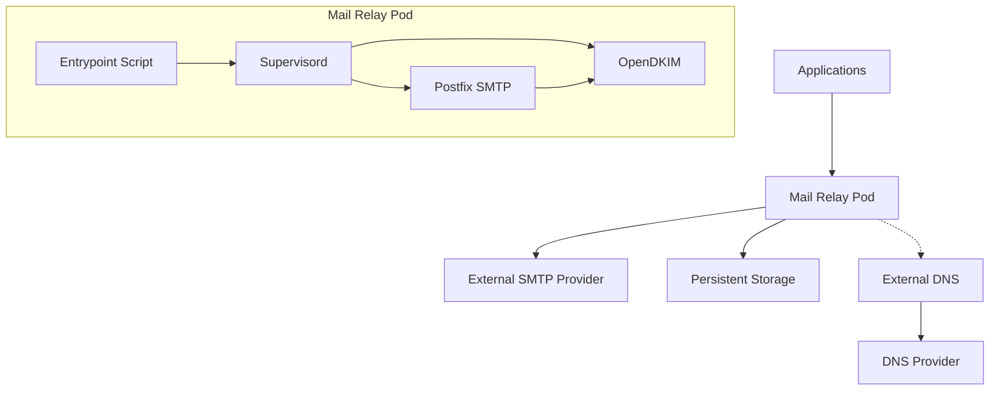

# Mail Relay Helm Chart

A production-ready Helm chart for deploying a secure SMTP mail relay server on Kubernetes with Postfix, OpenDKIM support, and containerized architecture.

## 🚀 Features

- **🔐 Secure Mail Relay**: Postfix-based SMTP relay with IPv4-only configuration
- **✍️ DKIM Signing**: Automatic DKIM key generation and email signing with OpenDKIM
- **🌐 DNS Management**: Automated DNS record management with external-dns integration
- **💾 Persistent Storage**: Optional persistent storage for mail queue and DKIM keys
- **❤️ Health Monitoring**: Built-in health checks and TCP probes
- **🔒 Security**: Network policies, RBAC, and security contexts
- **📊 Logging**: Direct stdout logging with supervisord process management
- **🐳 Containerized**: Supervisord-managed services with environment variable configuration## 📋 Architecture



## ⚡ Quick Start

### Prerequisites

- Kubernetes 1.20+
- Helm 3.2+
- LoadBalancer service support
- Container registry access (for custom builds)

### Installation

1. **Clone the repository**:

```bash
git clone https://github.com/lnking81/mail-relay-chart.git
cd mail-relay-chart
```

2. **Configure your values**:

```bash
cp values.byc.yaml my-values.yaml
# Edit my-values.yaml with your configuration
```

3. **Install the chart**:

```bash
# Install from local chart
helm install my-mail-relay ./chart -f my-values.yaml

# Or with namespace
helm install my-mail-relay ./chart -f my-values.yaml -n mail --create-namespace
```

## ⚙️ Configuration

### Core Parameters

| Parameter             | Description          | Default                             | Required |
| --------------------- | -------------------- | ----------------------------------- | -------- |
| `mail.hostname`       | SMTP server hostname | `mail.example.com`                  | ✅       |
| `mail.domains[].name` | Domains to handle    | `[]`                                | ✅       |
| `mail.relayHost`      | External SMTP relay  | `smtp.gmail.com`                    | ✅       |
| `mail.relayPort`      | External SMTP port   | `587`                               | ✅       |
| `image.repository`    | Container image      | `ghcr.io/lnking81/mail-relay-chart` | ✅       |
| `image.tag`           | Container tag        | `latest`                            | ✅       |

### DKIM Configuration

| Parameter           | Description         | Default |
| ------------------- | ------------------- | ------- |
| `dkim.enabled`      | Enable DKIM signing | `true`  |
| `dkim.autoGenerate` | Auto-generate keys  | `true`  |
| `dkim.keySize`      | RSA key size        | `2048`  |

### Storage Configuration

| Parameter                  | Description               | Default |
| -------------------------- | ------------------------- | ------- |
| `persistence.enabled`      | Enable persistent storage | `true`  |
| `persistence.size`         | Storage size              | `1Gi`   |
| `persistence.storageClass` | Storage class             | `""`    |

### Example Configuration

```yaml
# my-values.yaml
mail:
  hostname: mail.mycompany.com
  domains:
    - name: mycompany.com
      dkimSelector: mail
  relayHost: smtp.gmail.com
  relayPort: 587
  relayCredentials:
    enabled: true
    username: "your-username"
    password: "your-app-password"

dkim:
  enabled: true
  autoGenerate: true
  keySize: 2048

service:
  type: LoadBalancer
  loadBalancerIP: "192.168.1.100"

persistence:
  enabled: true
  size: 2Gi

externalDns:
  enabled: true
  provider: cloudflare
  autoManageDnsRecords: true
```

## 🐳 Container Architecture

### Environment Variables

The container uses environment variables for configuration:

| Variable                    | Description             | Source                          |
| --------------------------- | ----------------------- | ------------------------------- |
| `DKIM_ENABLED`              | Enable DKIM             | `dkim.enabled`                  |
| `DKIM_AUTO_GENERATE`        | Auto-generate keys      | `dkim.autoGenerate`             |
| `DKIM_KEY_SIZE`             | RSA key size            | `dkim.keySize`                  |
| `DKIM_DOMAINS`              | Comma-separated domains | `mail.domains`                  |
| `RELAY_CREDENTIALS_ENABLED` | Enable SMTP auth        | `mail.relayCredentials.enabled` |
| `SENDER_ACCESS_ENABLED`     | Enable sender access    | `mail.senderAccess.enabled`     |
| `PERSISTENCE_ENABLED`       | Enable persistence      | `persistence.enabled`           |

### Process Management

The container uses **supervisord** for robust process management:

| Service    | Purpose                 | Startup Priority | Auto-restart |
| ---------- | ----------------------- | ---------------- | ------------ |
| `opendkim` | DKIM email signing      | 100              | ✅           |
| `postfix`  | SMTP mail relay service | 200              | ✅           |

### Logging Architecture

**Direct stdout logging** without intermediate services:

```
Postfix   → stdout (via maillog_file = /dev/stdout)
OpenDKIM  → stdout (via -f -v flags, Syslog = no)
Supervisord → Container stdout/stderr
```

### Building Custom Image

```bash
# Build the container
cd mail-relay-chart
docker build -t ghcr.io/your-username/mail-relay-chart:latest ./docker/

# Push to registry
docker push ghcr.io/your-username/mail-relay-chart:latest

# Update values.yaml
image:
  repository: ghcr.io/your-username/mail-relay-chart
  tag: latest
```

## 🌐 DNS Configuration

### Automatic DNS Management

With external-dns enabled, the following records are created automatically:

```yaml
externalDns:
  enabled: true
  provider: cloudflare # or route53, google, etc.
  autoManageDnsRecords: true

  # Owner ID must match your external-dns installation
  # Check your external-dns deployment for the --txt-owner-id parameter
  ownerId: "k8s-cluster-external-dns" # Default value
  # For multiple clusters, use unique IDs like:
  # ownerId: "prod-cluster-external-dns"
  # ownerId: "staging-cluster-external-dns"
```

> **Important**: The `ownerId` must match the `--txt-owner-id` parameter in your external-dns deployment.
> Check with: `kubectl describe deployment external-dns -n kube-system | grep txt-owner-id`

### Manual DNS Configuration

If not using external-dns, create these DNS records:

```
# A record pointing to your LoadBalancer IP
mail.mycompany.com.  300  IN  A     192.168.1.100

# MX record for your domain
mycompany.com.       300  IN  MX    10 mail.mycompany.com.

# DKIM TXT record (get from pod logs)
mail._domainkey.mycompany.com.  300  IN  TXT  "v=DKIM1; k=rsa; p=MIGfMA0GCS..."
```

## 🔧 Operations

### Viewing DKIM Public Keys

```bash
# Get DKIM public keys for DNS
kubectl exec -n mail deployment/my-mail-relay -- find /data/dkim-keys -name "*.txt" -exec cat {} \;
```

### Testing Mail Relay

```bash
# Port forward for testing
kubectl port-forward -n mail service/my-mail-relay 2525:25

# Test SMTP connection
telnet localhost 2525
# > EHLO test.com
# > MAIL FROM: test@mycompany.com
# > RCPT TO: recipient@example.com
# > DATA
# > Subject: Test Email
# >
# > This is a test email.
# > .
# > QUIT
```

### Monitoring and Logs

```bash
# View container logs
kubectl logs -n mail deployment/my-mail-relay -f

# Check service status
kubectl get svc,pods -n mail

# View events
kubectl get events -n mail --sort-by='.firstTimestamp'
```

### Health Checks

The deployment includes TCP health checks:

```yaml
livenessProbe:
  tcpSocket:
    port: smtp
  initialDelaySeconds: 30
  periodSeconds: 10

readinessProbe:
  tcpSocket:
    port: smtp
  initialDelaySeconds: 15
  periodSeconds: 5
```

## 🚨 Troubleshooting

### Common Issues

#### 1. Container Startup Issues

```bash
# Check pod status
kubectl describe pod -n mail -l app.kubernetes.io/name=mail-relay

# Check container logs
kubectl logs -n mail deployment/my-mail-relay --previous

# Check individual service status via supervisord
kubectl exec -n mail deployment/my-mail-relay -- supervisorctl status
```

#### 2. Postfix Permission Errors

```bash
# If permissions are wrong, restart the pod to trigger permission rebuild
kubectl rollout restart -n mail deployment/my-mail-relay
```

#### 3. Service Management

```bash
# Restart individual services without restarting container
kubectl exec -n mail deployment/my-mail-relay -- supervisorctl restart postfix
kubectl exec -n mail deployment/my-mail-relay -- supervisorctl restart opendkim

# Check service logs
kubectl exec -n mail deployment/my-mail-relay -- supervisorctl tail postfix
kubectl exec -n mail deployment/my-mail-relay -- supervisorctl tail opendkim
```

#### 4. SMTP Connection Problems

```bash
# Test from within cluster
kubectl run test-pod --rm -it --image=busybox -- sh
# > telnet my-mail-relay.mail.svc.cluster.local 25
```

#### 5. DKIM Key Issues

```bash
# Check DKIM directory
kubectl exec -n mail deployment/my-mail-relay -- ls -la /data/dkim-keys/

# Regenerate DKIM keys
kubectl exec -n mail deployment/my-mail-relay -- rm -rf /data/dkim-keys/*
kubectl rollout restart -n mail deployment/my-mail-relay
```

#### 4. DNS Resolution Issues

```bash
# Check external-dns logs
kubectl logs -n kube-system deployment/external-dns

# Test DNS resolution
kubectl exec -n mail deployment/my-mail-relay -- nslookup gmail.com
```

### IPv6 Disabled Architecture

This chart uses IPv4-only configuration to avoid container DNS resolution issues:

```bash
# Verify IPv4-only mode
kubectl exec -n mail deployment/my-mail-relay -- postconf inet_protocols
# Should output: inet_protocols = ipv4
```

## 🔄 Backup and Recovery

### Backup Persistent Data

```bash
# Create backup
kubectl exec -n mail deployment/my-mail-relay -- tar -czf /tmp/mail-backup.tar.gz /data

# Copy backup locally
POD_NAME=$(kubectl get pods -n mail -l app.kubernetes.io/name=mail-relay -o jsonpath='{.items[0].metadata.name}')
kubectl cp mail/$POD_NAME:/tmp/mail-backup.tar.gz ./mail-backup-$(date +%Y%m%d).tar.gz
```

### Restore from Backup

```bash
# Copy backup to pod
kubectl cp ./mail-backup.tar.gz mail/$POD_NAME:/tmp/mail-backup.tar.gz

# Restore data
kubectl exec -n mail deployment/my-mail-relay -- tar -xzf /tmp/mail-backup.tar.gz -C /
kubectl rollout restart -n mail deployment/my-mail-relay
```

## 🧹 Cleanup

### Uninstall Release

```bash
# Remove Helm release
helm uninstall my-mail-relay -n mail

# Remove persistent data (optional)
kubectl delete pvc -n mail my-mail-relay-data

# Remove namespace (optional)
kubectl delete namespace mail
```

## 🛠️ Development

### Project Structure

```
mail-relay-chart/
├── README.md                    # This file
├── LICENSE                     # MIT License
├── values.byc.yaml             # Example values file
├── chart/                      # Helm chart
│   ├── Chart.yaml
│   ├── values.yaml
│   └── templates/
│       ├── deployment.yaml     # Simplified with env vars
│       ├── configmap-*.yaml
│       └── ...
└── docker/                     # Container build context
    ├── Dockerfile              # Debian 13 based image
    ├── supervisord.conf        # Process management config
    └── entrypoint.sh           # Environment-driven setup script
```

### Contributing

1. **Fork the repository**
2. **Create a feature branch**: `git checkout -b feature/amazing-feature`
3. **Make your changes**
4. **Test locally**: `helm install test ./chart -f values.yaml`
5. **Submit a pull request**

### Release Process

1. **Update Chart.yaml version**
2. **Build and push container**: `docker build -t ghcr.io/lnking81/mail-relay-chart:vX.X.X ./docker/`
3. **Create GitHub release**
4. **Update documentation**

## 📄 License

This project is licensed under the MIT License - see the [LICENSE](LICENSE) file for details.

## 🤝 Support

- **Documentation**: [GitHub Repository](https://github.com/lnking81/mail-relay-chart)
- **Issues**: [GitHub Issues](https://github.com/lnking81/mail-relay-chart/issues)
- **Discussions**: [GitHub Discussions](https://github.com/lnking81/mail-relay-chart/discussions)

---

**Made with ❤️ for Kubernetes mail relay deployments**
